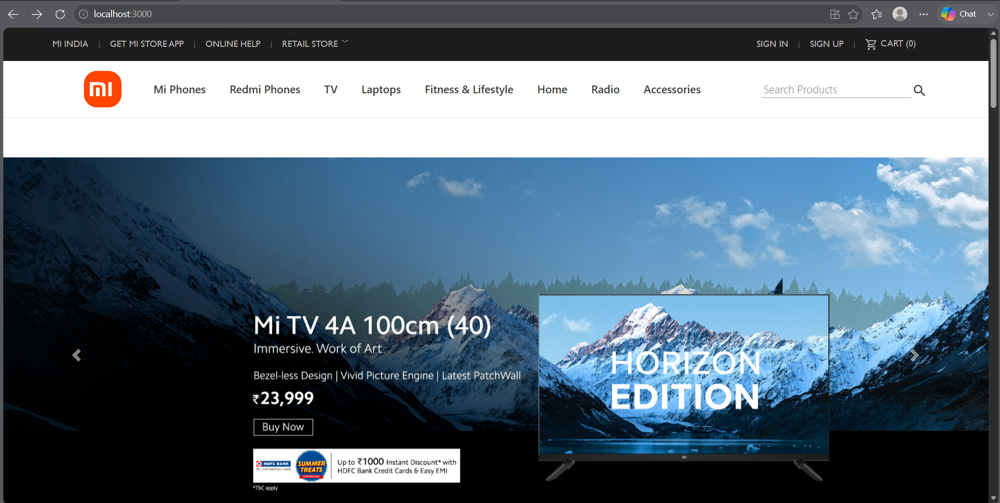

# MI Store Clone

A React.js-based clone of the Mi Store website. This project recreates the user interface of the official Mi Store and provides a responsive shopping experience across different devices.

## Features

- Responsive user interface
- Product showcase section
- Modern React component structure
- Fast and interactive design
- Mobile-friendly layout
- Reusable React components

## Tech Stack

- React.js
- JavaScript (ES6+)
- HTML5
- CSS3

## Installation

### Clone the repository

```bash
git clone https://github.com/deb811/MI-Store-Clone.git
```

### Navigate to the project directory

```bash
cd MI-Store-Clone
```

### Install dependencies

```bash
npm install
```

### Run the application

```bash
npm start
```

The application will run at:

```
http://localhost:3000
```

## Project Structure

```text
MI-Store-Clone
│
├── public
├── src
│   ├── components
│   ├── assets
│   ├── App.js
│   └── index.js
│
├── package.json
├── package-lock.json
└── README.md
```

## Learning Outcomes

Through this project I learned:

- React fundamentals
- Component-based architecture
- State and props management
- Responsive web design
- Project organization in React
- Frontend development best practices

## Future Improvements

- Add product search functionality
- Add shopping cart feature
- Add authentication system
- Integrate backend APIs
- Improve UI and animations

## Screenshots



## Author

**Devesh Anand**

- GitHub: https://github.com/deb811
- LinkedIn: Add your LinkedIn profile link here

## License

This project is created for learning and educational purposes.